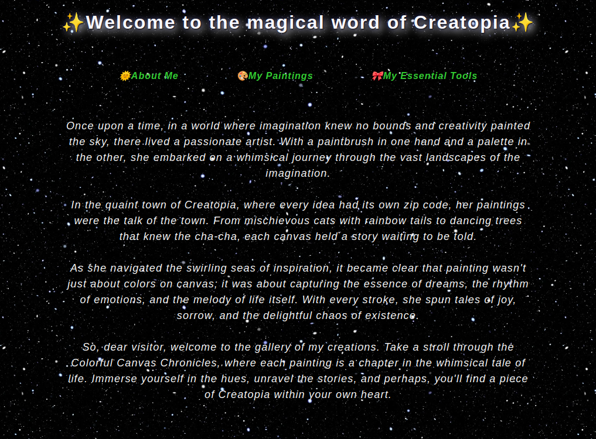

# My Django App

A simple Django application consisting of template views serving static pages like Home, About Me, My Paintings, and My Tools.



## Features

- Minimal Django application setup.
- Four pages served through URL mappings.
- Utilizes function-based views for the homepage.

## Requirements

- Python 3.x
- Django

## Installation

1. Clone this repository

Open a terminal and change the current directory to the location where you want to clone the repository.
Type the following command and press enter:

```bash
git clone https://github.com/scriubuguri/ShekelWorth.git
```

2. Create a virtual environment with the following command:

```bash
python3 -m venv venv
```

3. Activate the virtual environment:

```bash
source venv/bin/activate
```

4. Install dependencies

```bash
pip install -r requirements.txt
```

## Usage

Before run the app, open the `my_paintings` folder (where you have the `manage.py` file) and apply the migrations:

```bash
python3 manage.py migrate
```

Run the Django development server with the following command:

```sh
python manage.py runserver
```

Access the application in your web browser using the development server's address (typically `http://127.0.0.1:8000/`).

Utilize the URL paths to navigate between pages:
- Home: '/'
- About Me: '/about-me/'
- My Paintings: '/my-paintings/'
- My Tools: '/my-tools/'

## Author

- **scriubuguri**

